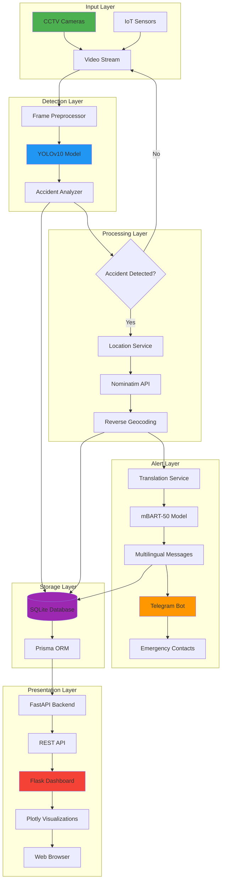
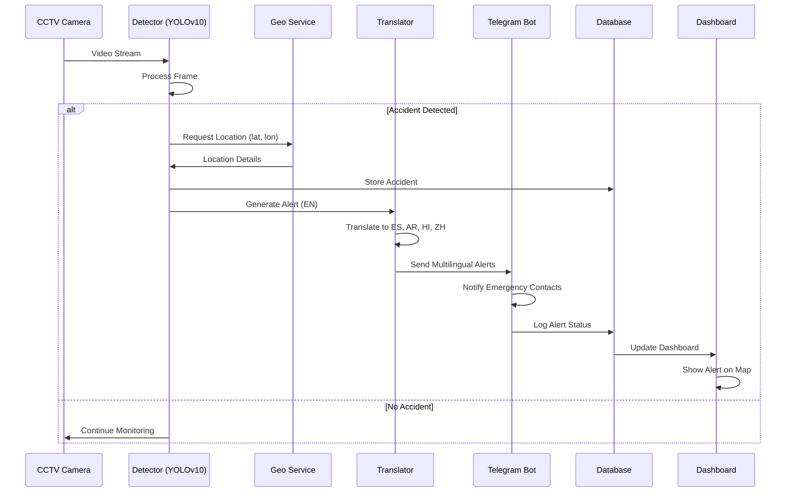
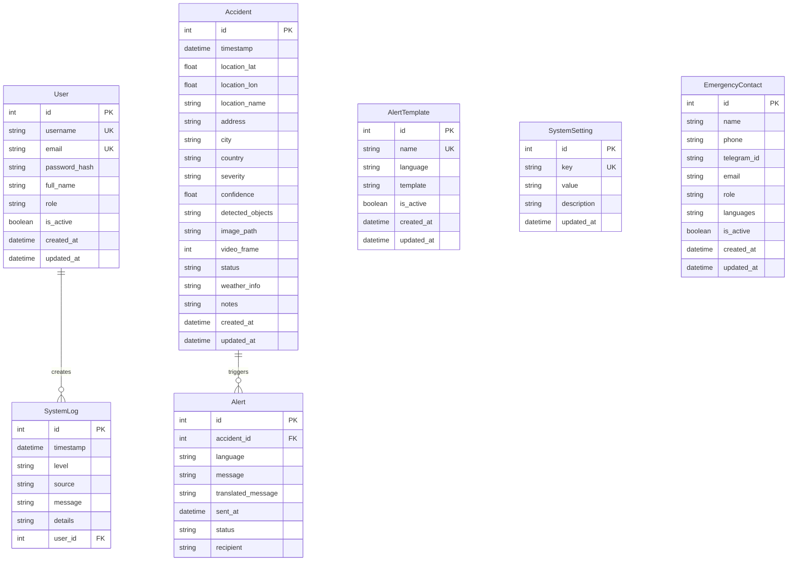
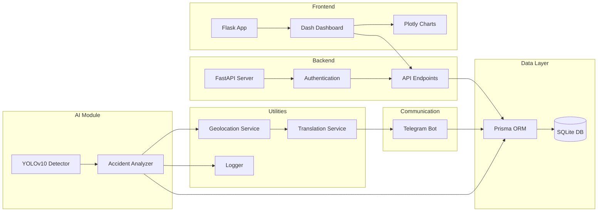
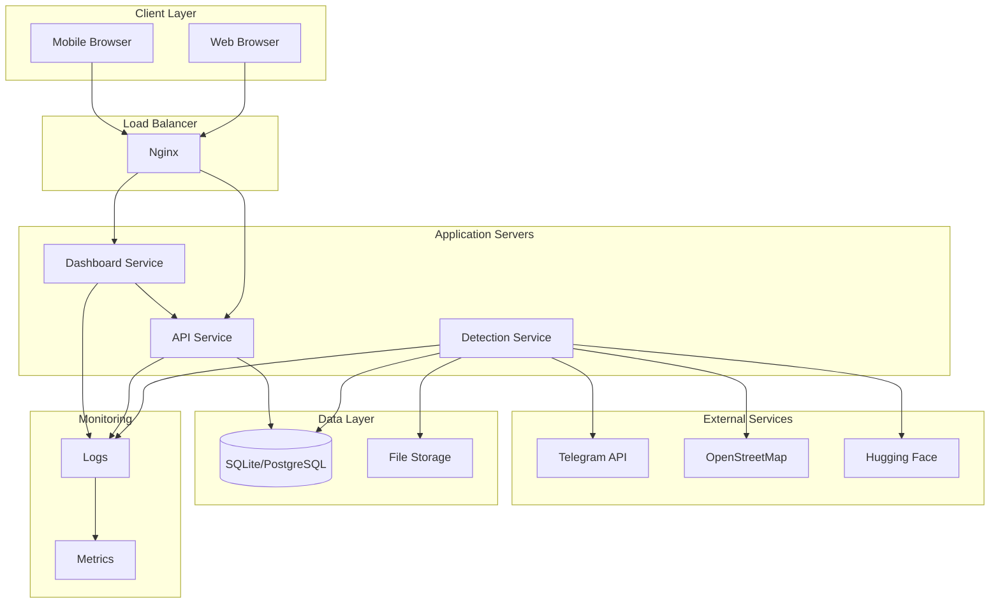
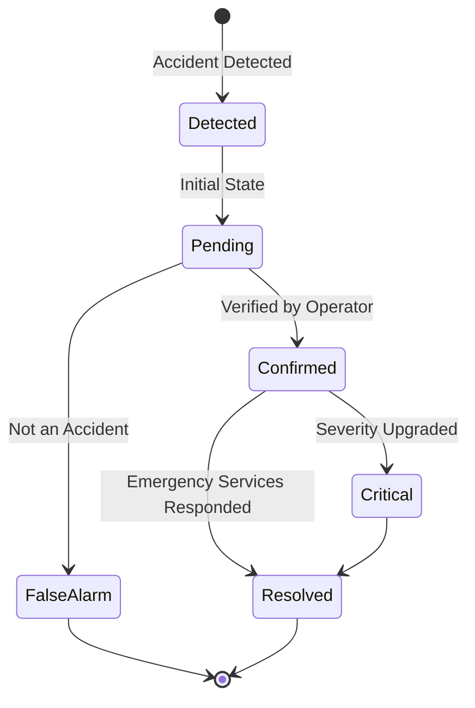
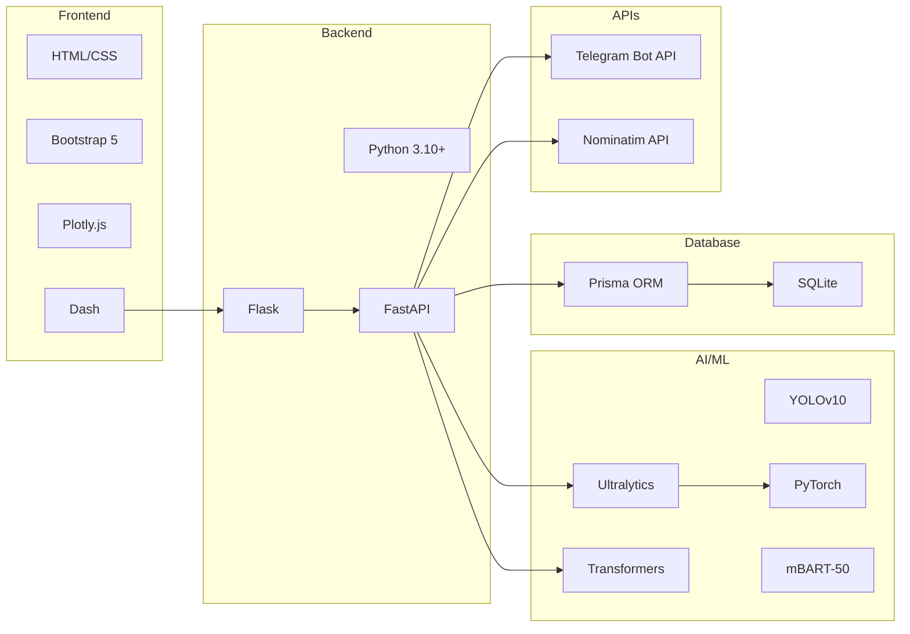

# System Architecture Diagram (Mermaid)

## Overall System Architecture

## Data Flow Diagram

## Database Entity-Relationship Diagram

## Component Interaction Diagram

## Deployment Architecture

## State Machine Diagram (Accident Status)

## Technology Stack Overview

